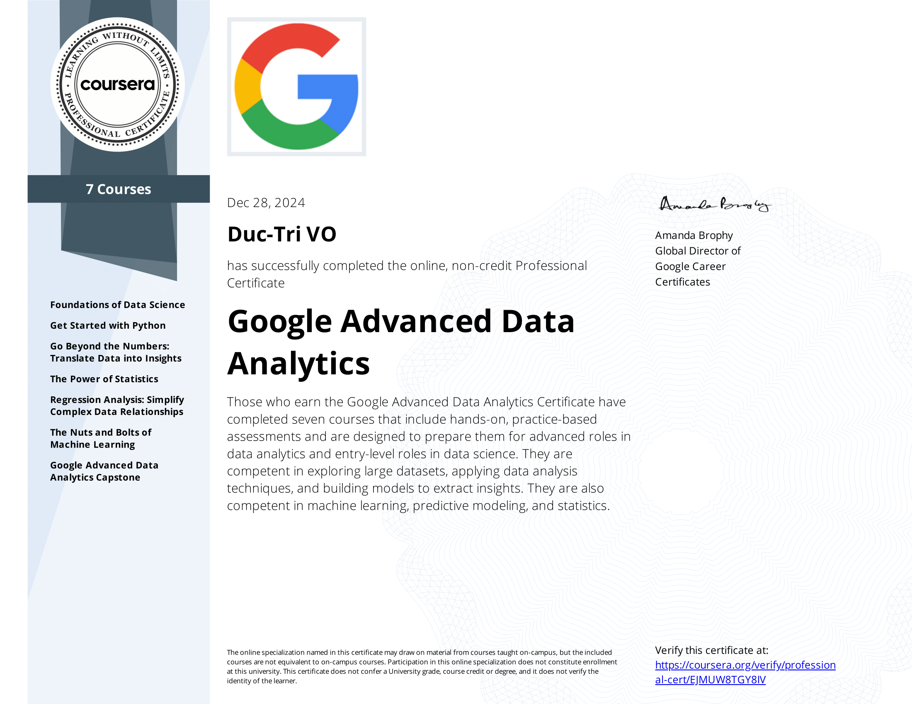

# Google Advanced Data Analytics Professional Certificate

Verify link: [Coursera.com](https://coursera.org/share/259bcf0a05b0e8271a80ff3fe0e0e14d)

Those who earn the Google Advanced Data Analytics Certificate have completed seven courses that include hands-on, practice-based assessments and are designed to prepare them for advanced roles in
data analytics and entry-level roles in data science. They are competent in exploring large datasets, applying data analysis techniques, and building models to extract insights. They are also competent in machine learning, predictive modeling, and statistics.

### Course:
1. Foundations of Data Science  
2. Get Started with Python  
3. Go Beyond the Numbers: Translate Data into Insights  
4. The Power of Statistics  
5. Regression Analysis: Simplify Complex Data Relationships  
6. The Nuts and Bolts of Machine Learning  
7. Google Advanced Data Analytics Capstone

### Projects:
1. Automatidata Project
2. Tiktok Project
3. Waze Project
4. Salifort Motors Project (Capstone Project)